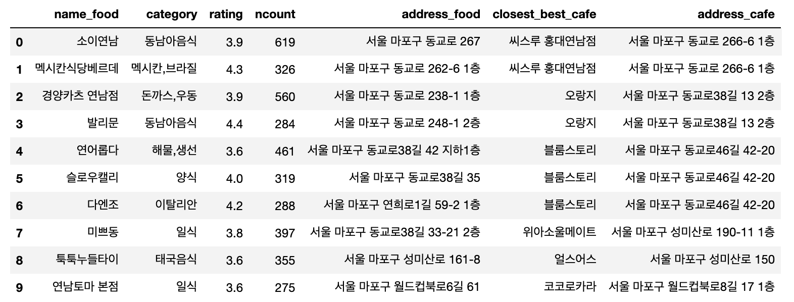

# 0. 인트로

- 데이트를 할 때마다 맛집을 찾는 일은 정말 수고스럽습니다.

- 5년간 맛집을 찾아 준비했던 경험을 바탕으로 제 일을 대신할 코드를 작성해봤습니다.

- `지역명+ 맛집` 키워드로 카카오맵에서 데이터를 크롤링 했습니다.

- 주관적 기준의 '내공있는 맛집'을 선별하여, 맛집기준으로 가장 가까운 '내공있는 카페'를 매칭해 추천했습니다.

- 태블로로 시각화하여 도로교통부가 제공한 Vworld 지도위에서 맛집정보를 볼 수 있도록 하였습니다.

  - https://public.tableau.com/app/profile/.51348188/viz/-NGMZ/1_1

  

  

# 1. 맛집 데이터 크롤링

- 구글맵에서 진행하려했으나 크롤링하기 어려운 구조라 카카오맵으로 변경
- 지역키워드를 입력하면 '지역키워드 + 맛집'으로 검색하여 서칭
- 결과물을 csv로 저장해서 recomender.ipynb에서 분석

# 2. 분석 후 맛집 추천

## 1) 데이터 전처리
- 결측치 처리
- 행 분류

## 2) 내공있는 맛집을 찾아서

- 포털사이트에서 맛집을 찾아다닌 개인적인 경험을 반영하여 **'내공있는 맛집'** 을 선정했습니다.
- 평점은 '최소한의 기준을 충족하는'의 기조로 정했습니다.
  - 제 기준에 만족하는 맛집도 포털사이트 평점이 낮았던 경험이 있었습니다.
  - 맛은 주관적이기에 어떤 맛집도 누군가에겐 1,2 점이 될 수 있기 때문입니다.
  - 평가자의 모수도 다 다르기에 평점순으로 소팅하는 것으로는 맛집을 찾을 수 없었습니다.
  - 최소한의 기준 3.5를 책정하여 분류했습니다.

- 리뷰 수는 '많을 수록 좋다'의 기조로 정했습니다.
  - 평점을 유지하면서 많은 리뷰 수를 쌓는 것은 매우 힘든 일 입니다.
  - 개인적인 경험에서도 평점보다는 많은 리뷰 수를 가지고있는 집이 맛집인 경우가 많았습니다.

- **'많은 리뷰에 기준 이상의 평점을 가진 집'** 을 **내공있는 맛집** 으로 선정하였습니다.

## 3) 맛집 후 커피 한잔

- 술자리가 아닌 이상 식사후에 갈 수 있는 카페를 같이 알아놓으면 항상 좋았습니다.
- 카카오맵에서 같이 스크래핑된 카페 정보로 맛집 카페를 추천합니다.
- **'내공있는 카페'의 기준** 은 음식점과 동일합니다.
  - 평점 3.5이상, 리뷰 수 상위 10개

- 식사 후 카페까지 이동거리가 너무 멀면 동행자의 불만족을 유발할 수 있습니다.

  - 카카오 api를 통해 주소의 위경도를 불러옵니다.

  - 먼저 선정한 **'내공있는 맛집'기준, 가장 가까운 '내공있는 카페'**를 추천합니다.

    

## 4) 데이터 결과

- '연남동'지역의 **'내공있는 맛집'** 과 가장 가까운 **'내공있는 카페'** 매칭한 데이터 결과물입니다.

## 5) 테블로 시각화

- 태블로에서 시각화하기 좋은 포멧으로 전처리 합니다.
- 도로교통부가 제공한 Vworld 지도를 임포트합니다.
- 위경도로 위치를 표시하고 이름별로 지도에 마킹할 수 있도록 합니다.
- match_id 별로 선으로 이어질 수 있도록 하고, kind 로 굵기 조절을 하여, '음식점에서 카페로'방향성을 나타냅니다.
- match_id 별로 필터를 걸어 필요한 정보만 맵에서 볼 수 있도록 합니다.

- [태블로 결과물 링크](https://public.tableau.com/app/profile/.51348188/viz/-NGMZ/1_1)

# Reference

- [셀레니움 활용방법](https://rlagywns0213.github.io/data%20visualization/cafemap/)
- [셀레니움 문법](https://greeksharifa.github.io/references/2020/10/30/python-selenium-usage/#%EA%B8%B0%ED%83%80-%EA%B8%B0%EB%8A%A5)
- [dictionary value 최소값으로 key찾기](https://gomguard.tistory.com/137)

